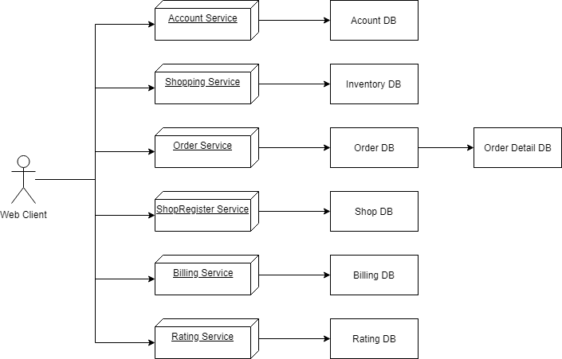

# ShoppingCenter
## Introduction
Shopping Center เป็นระบบที่ให้บริการในด้านของการซื้อ-ขายสินค้า ซึ่งจะทำหน้าที่ในการให้ร้านค้าแต่ร้านมาลงทะเบียนกับะบบและขายสินค้าของร้านค้าตนเอง และให้ลูกค้ามาซื้อสินค้าของแต่ละร้านได้
## User role
  - ระบบนี้จะแบ่งผู้ใช้งานเป็น 2 ฝ่าย
    - ฝ่ายลูกค้า สามารถที่จะซื้อสินค้าของแต่ละร้านค้า และสามารถให้คะแนนกับสินค้าที่ได้ซื้อไปแล้ว
    - ฝ่ายร้านค้า สามารถลงทะเบียนกับระบบเพื่อขายสินค้าของร้านค้าตนเอง และจัดการสินค้าของร้านตนเองได้
## Features
 - Account Service -> ทำหน้าที่ ให้ผู้ใช้ลงทะเบียนหรือเข้าสู่ระบบเพื่อเข้าใช้งาน
 - Shopping Service -> ทำหน้าที่ แสดงร้านค้า สินค้า รายละเอียดของสินค้า
 - Order Service -> ทำหน้าที่ ให้ผู้ใช้สั่งซื้อสินค้า
 - ShopRegister Service -> ทำหน้าที่ ให้ร้านค้ามาลงทะเบียนกับระบบ และจัดการสินค้าร้านค้าของตนเอง
 - Biling Service -> เมื่อผู้ใช้ชำระสินค้า จะทำหน้าที่เก็บรายละเอียดของการชำระสินค้า
 - Rating Service -> ทำหหน้าที่ให้ผู้ใช้ได้ให้คะเนนกับสินค้าที่ตนเองได้ซื้อไปแล้ว และวิเคราห์คะแนนของแต่ละร้านค้า

